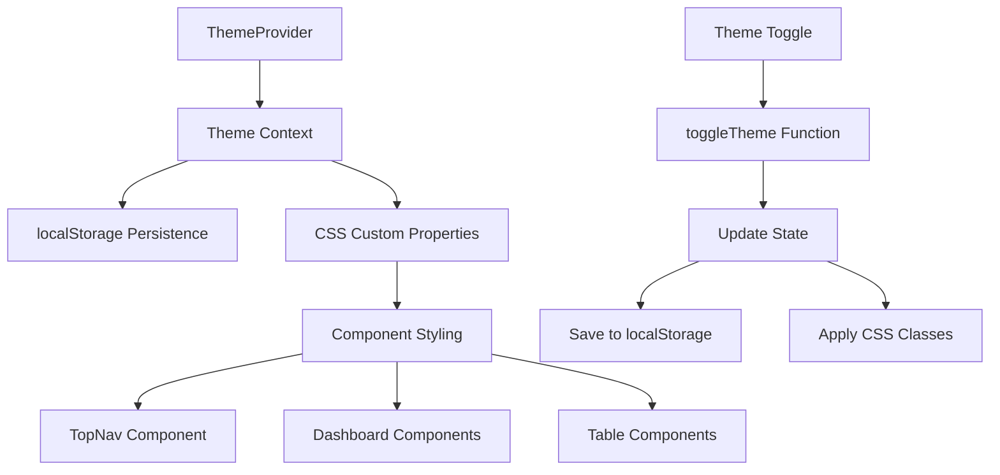
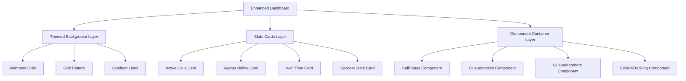

# Call Center Dashboard Enhancement Design

## Overview

This design document outlines the technical approach for transforming the existing call center dashboard into a premium, visually impressive monitoring interface. The design focuses on implementing a robust theme system, enhancing component styling with yellow-black color schemes, and creating smooth animations that maintain professional aesthetics while ensuring excellent performance.

## Architecture

### Theme System Architecture



The theme system will use React Context for state management, CSS custom properties for dynamic theming, and localStorage for persistence. This ensures immediate theme changes across all components.

### Component Enhancement Architecture



## Components and Interfaces

### 1. Enhanced Theme Context

```typescript
interface ThemeContextType {
  isDarkMode: boolean;
  toggleTheme: () => void;
  colors: {
    primary: string;
    secondary: string;
    background: string;
    surface: string;
    text: string;
    accent: string;
  };
}
```

**Key Features:**
- Immediate theme switching with CSS custom properties
- Persistent storage with localStorage
- Dynamic color calculation based on theme mode
- Performance-optimized re-renders

### 2. Enhanced TopNav Component

**Design Elements:**
- Glassmorphism dropdown menus with backdrop-blur
- Animated logo with rotating phone icon on hover
- Smooth theme toggle with sun/moon icons
- Yellow gradient apply config button
- Consistent hover states with yellow accents

**Technical Implementation:**
- CSS-in-JS for dynamic theming
- Framer Motion for smooth animations
- Proper ARIA labels for accessibility
- Mobile-responsive dropdown behavior

### 3. Dashboard Layout Enhancement

**Background Layer:**
```css
.dashboard-background {
  background: linear-gradient(135deg, #000000 0%, #1F2937 50%, #000000 100%);
  position: relative;
  overflow: hidden;
}

.floating-orb {
  position: absolute;
  border-radius: 50%;
  background: radial-gradient(circle, #FBBF24, #F59E0B);
  animation: float 6s ease-in-out infinite;
  opacity: 0.1;
}

.grid-pattern {
  background-image: 
    linear-gradient(rgba(251, 191, 36, 0.03) 1px, transparent 1px),
    linear-gradient(90deg, rgba(251, 191, 36, 0.03) 1px, transparent 1px);
  background-size: 50px 50px;
}
```

**Stats Cards Design:**
- Glassmorphism cards with backdrop-blur
- Animated counters for real-time data
- Icon animations with Lucide React icons
- Hover effects with scale transforms
- Yellow accent borders and highlights

### 4. Enhanced Table Components

**CallStatus Component Enhancement:**
```typescript
interface EnhancedCallStatusProps {
  activeCalls: ActiveCall[];
  theme: 'dark' | 'light';
}
```

**Design Features:**
- Dark themed table with yellow accents
- Animated status badges with pulse effects
- Hover row highlighting with yellow glow
- Action buttons with consistent theming
- Loading states with skeleton animations

**QueueMetrics Component Enhancement:**
- Progress bars with yellow fill colors
- Status indicators with animated backgrounds
- Search functionality with themed input
- Responsive table design
- Real-time update animations

**QueueMembers Component Enhancement:**
- Agent status with color-coded indicators
- Pause reason tooltips with dark theming
- Filter dropdown with consistent styling
- Member cards for mobile view
- Activity indicators with pulse animations

### 5. Animation System

**Keyframe Animations:**
```css
@keyframes fadeInUp {
  from {
    opacity: 0;
    transform: translateY(30px);
  }
  to {
    opacity: 1;
    transform: translateY(0);
  }
}

@keyframes pulse-glow {
  0%, 100% {
    box-shadow: 0 0 5px rgba(251, 191, 36, 0.3);
  }
  50% {
    box-shadow: 0 0 20px rgba(251, 191, 36, 0.6);
  }
}

@keyframes float {
  0%, 100% { transform: translateY(0px) rotate(0deg); }
  33% { transform: translateY(-20px) rotate(120deg); }
  66% { transform: translateY(10px) rotate(240deg); }
}
```

**Performance Considerations:**
- Use `transform` and `opacity` for GPU acceleration
- Implement `will-change` property for animated elements
- Debounce theme changes to prevent excessive re-renders
- Use CSS containment for isolated animations

## Data Models

### Theme Configuration Model

```typescript
interface ThemeConfig {
  mode: 'dark' | 'light';
  colors: {
    primary: {
      50: string;
      100: string;
      400: string;
      500: string;
      600: string;
    };
    background: {
      primary: string;
      secondary: string;
      surface: string;
    };
    text: {
      primary: string;
      secondary: string;
      accent: string;
    };
  };
  animations: {
    duration: {
      fast: string;
      normal: string;
      slow: string;
    };
    easing: {
      default: string;
      bounce: string;
    };
  };
}
```

### Component State Models

```typescript
interface DashboardState {
  activeCalls: ActiveCall[];
  queueMetrics: QueueMetric[];
  queueMembers: QueueMember[];
  incomingCalls: IncomingCall[];
  isLoading: boolean;
  lastUpdate: Date;
}

interface AnimationState {
  isVisible: boolean;
  animationPhase: 'entering' | 'idle' | 'updating';
  pendingUpdates: number;
}
```

## Error Handling

### Theme System Error Handling

1. **localStorage Failures:**
   - Graceful fallback to default dark theme
   - Error logging without breaking functionality
   - Retry mechanism for storage operations

2. **CSS Loading Failures:**
   - Fallback to inline styles
   - Progressive enhancement approach
   - Error boundaries for theme-dependent components

3. **Animation Performance Issues:**
   - Automatic animation reduction on low-end devices
   - Frame rate monitoring and adjustment
   - Graceful degradation to static styles

### Component Error Boundaries

```typescript
interface ErrorBoundaryState {
  hasError: boolean;
  errorMessage: string;
  componentStack: string;
}

class DashboardErrorBoundary extends Component<Props, ErrorBoundaryState> {
  // Catch theme-related errors and provide fallback UI
  // Log errors for debugging
  // Maintain dashboard functionality even with component failures
}
```

## Testing Strategy

### Theme System Testing

1. **Unit Tests:**
   - Theme context state management
   - localStorage persistence
   - Color calculation functions
   - Animation timing functions

2. **Integration Tests:**
   - Theme changes across components
   - Performance impact measurement
   - Cross-browser compatibility
   - Mobile responsiveness

3. **Visual Regression Tests:**
   - Screenshot comparisons for both themes
   - Animation frame testing
   - Component styling consistency
   - Accessibility contrast validation

### Component Enhancement Testing

1. **Functional Tests:**
   - Real-time data updates with theming
   - Socket connection handling
   - User interaction flows
   - Error state handling

2. **Performance Tests:**
   - Animation frame rate monitoring
   - Memory usage during theme changes
   - Large dataset rendering performance
   - Mobile device performance

3. **Accessibility Tests:**
   - Screen reader compatibility
   - Keyboard navigation
   - Color contrast ratios
   - Focus management

## Implementation Phases

### Phase 1: Theme System Foundation
- Implement robust ThemeContext with persistence
- Create CSS custom property system
- Add theme toggle functionality
- Test cross-component theme propagation

### Phase 2: Navigation Enhancement
- Redesign TopNav with yellow-black theme
- Implement glassmorphism effects
- Add smooth animations and transitions
- Ensure mobile responsiveness

### Phase 3: Dashboard Background and Layout
- Create animated background system
- Implement stats cards with real-time data
- Add floating elements and grid patterns
- Optimize performance for animations

### Phase 4: Component Enhancement
- Enhance CallStatus component styling
- Redesign QueueMetrics with yellow accents
- Improve QueueMembers visual design
- Update CallersTracking component theme

### Phase 5: Polish and Optimization
- Fine-tune animations and transitions
- Optimize performance across devices
- Add accessibility improvements
- Conduct thorough testing and bug fixes

## Performance Considerations

### Optimization Strategies

1. **CSS Optimization:**
   - Use CSS custom properties for theme switching
   - Minimize repaints and reflows
   - Implement efficient animation techniques
   - Use CSS containment for isolated updates

2. **React Optimization:**
   - Implement proper memoization for theme-dependent components
   - Use React.memo for expensive renders
   - Optimize context usage to prevent unnecessary re-renders
   - Implement virtual scrolling for large datasets

3. **Animation Performance:**
   - Use transform and opacity for GPU acceleration
   - Implement animation frame monitoring
   - Provide reduced motion options
   - Optimize animation timing functions

### Monitoring and Metrics

- Frame rate monitoring during animations
- Memory usage tracking during theme changes
- Bundle size impact measurement
- User interaction response times
- Mobile device performance metrics